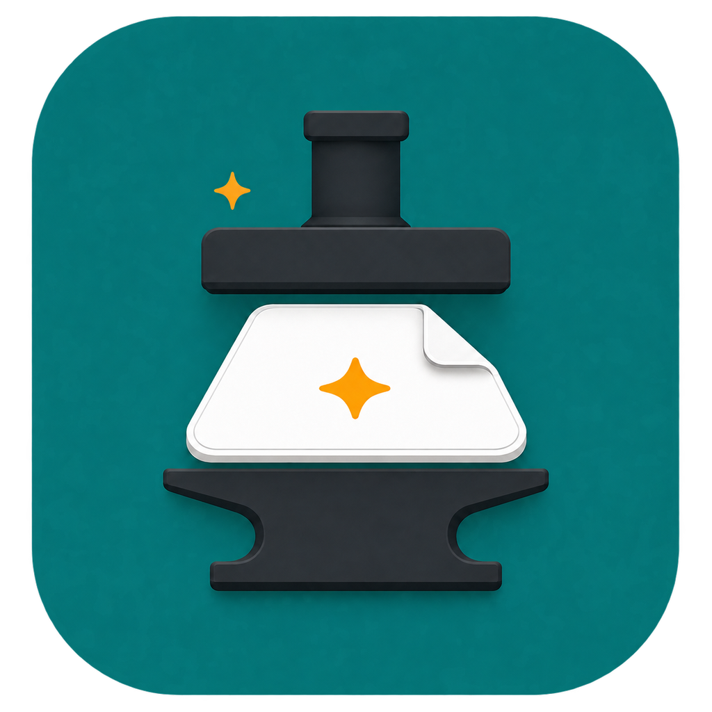

<p align="center">
  
</p>

<h1 align="center">Sticker Foundry</h1>

<p align="center">
  Create, organize, and share beautiful WhatsApp sticker packs from one private workspace.
</p>

<p align="center">
  <a href="LICENSE"></a>
  <a href="https://github.com/saitatter/sticker-foundry/releases"></a>
  <a href="https://github.com/saitatter/sticker-foundry/issues"></a>
</p>

Sticker Foundry is a self-hosted home for your sticker collection. Drop in images, clean them up, arrange them into packs, work with other people, and send the finished packs to WhatsApp.

## What you can do

### Make stickers quickly

- Upload one image or a whole batch at once.
- Crop, resize, add text, and polish images with erase and restore brushes.
- Remove backgrounds with local AI using `rembg`, with a reliable automatic fallback when needed.
- Prepare animated stickers with trimming, frame-rate, and quality controls.
- Compare the original and edited image before saving.

### Keep every pack organized

- Browse packs in an album-style library with covers, search, and quick switching.
- Reorder stickers with drag and drop, keyboard controls, or multi-select actions.
- Add emojis and accessibility text so every sticker is easy to find and use.
- Review sticker status, inspect recent changes, and download ready-to-share exports.
- Use light or dark theme; your choice is remembered across visits.

### Work together safely

- Invite collaborators as editors or viewers for each pack.
- Add comments and review stickers without losing the surrounding context.
- See pack activity with before-and-after details.
- Keep an instance-wide security audit history for important administrative changes.

### Use packs where you need them

- Export packs in WhatsApp-ready formats.
- Publish selected packs for sharing when you want to.
- Sync packs in the Android companion app and import them into WhatsApp or WhatsApp Business.

### Keep control of your collection

- Run Sticker Foundry on your own computer or server.
- Keep uploaded images and AI processing inside your installation by default.
- Configure registration, storage limits, audit retention, and the instance name from the admin page.

## Start in a few minutes

The easiest local setup uses Docker Desktop. After Docker is installed:

1. Download this repository and open a terminal in its folder.
2. Create your local settings file:

   ```bash
   # macOS / Linux
   cp .env.example .env
   ```

   On Windows PowerShell, use `Copy-Item .env.example .env` instead.

3. Start Sticker Foundry:

   ```bash
   docker compose up -d --build
   ```

4. Add the demo account and sample pack:

   ```bash
   docker compose exec backend npm run prisma:seed
   ```

Open [http://localhost:8080](http://localhost:8080).

| What | Address |
| --- | --- |
| Sticker Foundry | [http://localhost:8080](http://localhost:8080) |
| API health | [http://localhost:3000/api/health](http://localhost:3000/api/health) |
| API reference | [http://localhost:3000/api/docs](http://localhost:3000/api/docs) |

The demo account is:

```text
Email:    demo@stickerfoundry.local
Password: stickerfoundry123
```

Change or remove the demo account before sharing the installation with other people.

## A good first tour

1. Open the demo pack from the library.
2. Upload an image and try background removal in the editor.
3. Add a short accessibility description and a few emojis.
4. Move stickers into the order you want people to see.
5. Open Activity to inspect the change history.
6. Export the pack or sync it from the Android app.

## Android companion app

The Android app keeps a local copy of your packs and can hand them to WhatsApp or WhatsApp Business. Point it at the server address reachable from your phone, sign in, sync, and choose a pack to import.

If you are building the Android app from this repository, use JDK 17 and run:

```bash
cd apps/android
./gradlew :app:assembleDebug
```

## Sharing the installation

Sticker Foundry is ready for a private home network out of the box. Before exposing it to the internet:

- use HTTPS;
- replace the default database password and JWT secret in `.env`;
- use invite-only registration if the instance is shared;
- make regular backups of the database and uploaded files.

See the [production checklist](docs/PRODUCTION_CHECKLIST.md) and [reverse proxy examples](docs/REVERSE_PROXY.md) for the full setup.

## Useful commands

```bash
# See whether all services are running
docker compose ps

# Follow server messages while testing
docker compose logs -f backend

# Stop the local installation without deleting its data
docker compose stop

# Stop the installation and remove its containers
docker compose down
```

For local development, install Node.js 20 or newer, then run:

```bash
npm install
npm run dev:seeded
```

## Project guides

- [Production checklist](docs/PRODUCTION_CHECKLIST.md)
- [Reverse proxy examples](docs/REVERSE_PROXY.md)
- [Android signing](docs/ANDROID_SIGNING.md)
- [WhatsApp validation](docs/WHATSAPP_VALIDATION.md)
- [Docker validation](docs/DOCKER_VALIDATION.md)
- [Release notes guide](docs/RELEASE_NOTES.md)
- [Feature backlog](docs/FEATURES_TO_ADD.md)

## License

Sticker Foundry is released under the [MIT License](LICENSE).

## Support

[](https://ko-fi.com/saitatter)
